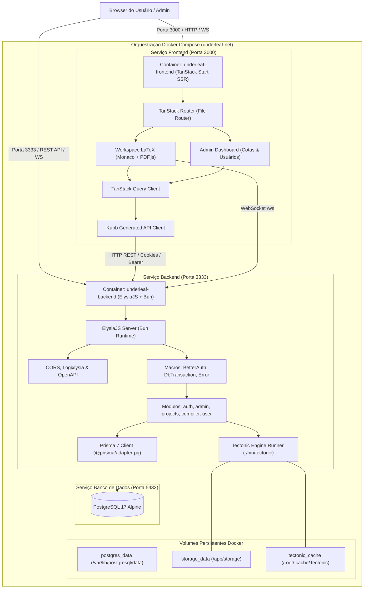
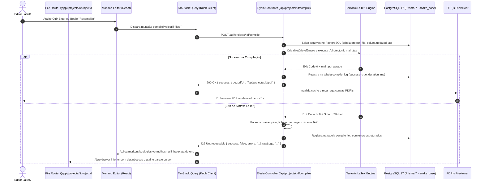

# Plano de Desenvolvimento — Underleaf

Plataforma Open-Source colaborativa para edição e compilação LaTeX com gestão administrativa avançada de usuários, cotas e projetos.

---

## 1. Visão Geral e Objetivos

O **Underleaf** é uma alternativa open-source, moderna e de alta performance ao Overleaf. A plataforma adota uma arquitetura desacoplada em monorepo com Bun workspaces (`apps/*`), unindo um backend robusto e veloz em **ElysiaJS + Bun** a um frontend reativo e SSR construído com **React 19 + TanStack Start** e **TanStack Router (File Router)**, com suporte completo a **deploy automatizado via Docker Compose**.

### Pilares Fundamentais:
1. **Governança e Administração de Primeira Classe**: Painel administrativo para controle granular de cotas de armazenamento, papéis de usuários (`admin`, `editor`, `viewer`), auditoria detalhada via `audit_log`, suspensão/ativação de contas e métricas do sistema em tempo real.
2. **Backend Modular de Alto Desempenho (Base Origox)**: Estruturado no padrão de `/apps/origox/origox/apps/backend/`, utilizando **Bun**, **ElysiaJS**, macros declarativas de autenticação (`BetterAuthMacro`), transações interativas com rollback (`DbTransactionMacro`), tratamento padronizado de erros (`ErrorMacro`) e documentação OpenAPI integrada (`@elysia/openapi`).
3. **Persistência Confiável com Prisma 7 e Nomenclatura snake_case**:
   - Conectado ao PostgreSQL 17 (`underleaf-postgres` via Docker) através de `@prisma/adapter-pg` com runtime nativo do Bun.
   - **Padrão snake_case obrigatório**: Todas as tabelas (`@@map("nome_tabela")`) e todas as colunas (`@map("nome_coluna")`) mapeadas rigorosamente em snake_case no PostgreSQL.
   - Extensão `$extends` no Prisma Client para gravação automática de auditoria na tabela `audit_log` para mutações (`create`, `update`, `delete`, `upsert`).
   - Gerador automático de schemas Zod (`prisma-zod-generator`).
4. **Frontend Moderno com TanStack Start & File Router (Base Radar ERP Web)**:
   - Baseado em `/apps/erp/radar-erp-web/`, utilizando **React 19**, **TanStack Start** (SSR com Nitro + Vite 8).
   - **TanStack Router com File Router**: Roteamento estático baseado no sistema de arquivos (`apps/frontend/src/routes/`), com route groups `(auth)`, `(app)`, `(admin)`, rotas dinâmicas `$projectId.tsx`, layouts compartilhados `route.tsx`, validação tipada de search params com Zod e geração automática de `src/routeTree.gen.ts` via CLI `tsr`.
   - **TanStack Query**: Gerenciamento de estado de servidor, cache reativo e invalidação automática.
   - **Design System**: **Tailwind CSS v4** (`@tailwindcss/vite`), componentes **Radix UI / shadcn UI**, ícones com **Lucide React** e notificações com **Sonner**.
   - **Kubb**: Tipagem fim-a-fim gerada automaticamente a partir da documentação `/openapi` do backend.
5. **Editor LaTeX e Visualização Profissional**:
   - **Monaco Editor**: Realce de sintaxe LaTeX, autocompletes (`\begin{}`, `\cite{}`, `\ref{}`), snippets e marcação de erros na linha exata com base no log do compilador.
   - **PDF.js Viewer**: Visualizador de alta fidelidade com zoom dinâmico, ajuste de página e atualização instantânea sem recarregar a tela.
   - **Painéis Redimensionáveis**: Layout split-pane com `react-resizable-panels` (Explorer de Arquivos, Editor de Código, Visualizador de PDF e Console de Compilação).
6. **Motor LaTeX com Tectonic**: Compilação local e sob demanda usando o binário autônomo do Tectonic (`./bin/tectonic`), com download dinâmico de pacotes TeXLive, workspaces isolados por compilação e streaming direto do PDF gerado.
7. **Deploy e Orquestração com Docker Compose**: Suporte a implantação completa em produção com um único comando (`docker compose up -d --build`), incluindo serviço de banco de dados PostgreSQL 17 com volumes persistentes, backend ElysiaJS com cache persistente de pacotes TeXLive e frontend TanStack Start SSR otimizado para produção.

---

## 2. Decisões Arquiteturais e Diretrizes

> [!IMPORTANT]
> **Deploy com Docker Compose**:
> A plataforma Underleaf inclui orquestração oficial para desenvolvimento e produção via `docker-compose.yml`:
> - **Serviço `postgres`**: PostgreSQL 17 Alpine com volume persistente para dados e healthcheck nativo via `pg_isready`.
> - **Serviço `backend`**: Container Bun multi-stage compilando o servidor ElysiaJS, executando migrations na inicialização (`prisma db push` / `prisma migrate deploy`) e persistindo o diretório de compilações (`storage_data`) e o cache de pacotes TeXLive do Tectonic (`tectonic_cache`).
> - **Serviço `frontend`**: Container Bun multi-stage gerando o bundle de produção do TanStack Start com engine Nitro (`.output/server/index.mjs`) escutando na porta `3000`.
> - **Rede e Volumes Isolados**: Rede bridge interna `underleaf-net` e volumes nomeados para garantir persistência total entre reinicializações de container.

> [!IMPORTANT]
> **Convenção de Banco de Dados — Padrão snake_case Estrito**:
> Todas as tabelas e colunas no PostgreSQL seguem rigorosamente a convenção `snake_case`. No Prisma Schema:
> - Modelos possuem `@@map("nome_tabela")` (ex: `@@map("user")`, `@@map("session")`, `@@map("project")`, `@@map("project_file")`, `@@map("compile_log")`, `@@map("audit_log")`, `@@map("system_setting")`).
> - Todos os campos possuem `@map("nome_coluna")` (ex: `@map("created_at")`, `@map("updated_at")`, `@map("owner_id")`, `@map("project_id")`, `@map("user_id")`, `@map("storage_used_mb")`, `@map("quota_mb")`, `@map("is_main")`, `@map("size_bytes")`, `@map("duration_ms")`, `@map("raw_output")`).
> - Essa padronização garante conformidade total com convenções clássicas de PostgreSQL e com o padrão adotado no Origox.

> [!IMPORTANT]
> **Frontend: TanStack Start com File Router (TanStack Router)**:
> - Mantém-se o framework full-stack **TanStack Start** (SSR via Nitro/Vite 8), conforme definido no projeto.
> - O roteamento é obrigatoriamente gerido pelo **File Router do TanStack Router**:
>   - Definição de rotas em arquivos e pastas sob `src/routes/`.
>   - Cada rota utiliza `createFileRoute('/caminho')({ ... })` ou `createRootRouteWithContext<Context>()({ ... })`.
>   - Estruturação em **Route Groups** organizacionais: `(auth)` para login/registro, `(app)` para workspace e projetos, `(admin)` para painel de governança.
>   - Rotas de layout `route.tsx` fornecem shells visuais e guards (`beforeLoad`) aninhados.
>   - O arquivo de rotas compilado `src/routeTree.gen.ts` é gerado automaticamente pelo CLI `tsr generate` e pelo plugin Vite do TanStack Start.

> [!NOTE]
> **Padrão de Backend (Referência: `/apps/origox/origox/apps/backend/`)**:
> - Organização modular por domínio em `src/modules/<feature>/` (`auth`, `admin`, `projects`, `compiler`, `user`).
> - Macros de infraestrutura em `src/macros/` (`BetterAuthMacro`, `DbTransactionMacro`, `ErrorMacro`).
> - Banco em `src/lib/db.ts` com `@prisma/adapter-pg`, `AsyncLocalStorage` e `$extends` para auditoria automática.
> - Validação estrita de variáveis de ambiente com Zod em `src/lib/env.ts`.

---

## 3. Diagramas de Arquitetura

### 3.1. Arquitetura Geral do Sistema e Orquestração Docker



### 3.2. Fluxo de Compilação Reativo (File Route `$projectId.tsx` + Backend Elysia)



---

## 4. Modelagem de Dados com Prisma 7 (Padrão snake_case Estrito)

O arquivo [schema.prisma](file:///apps/underleaf/apps/backend/prisma/schema.prisma) modela todas as tabelas e colunas com mapeamento explícito em `snake_case` via `@@map` e `@map`:

```prisma
datasource db {
  provider = "postgresql"
  url      = env("DATABASE_URL")
}

generator client {
  provider   = "prisma-client"
  output     = "../src/generated/prisma"
  engineType = "client"
  runtime    = "bun"
}

generator zod {
  provider = "prisma-zod-generator"
  output   = "../src/generated/prisma"
}

enum AuditAction {
  CREATE
  UPDATE
  DELETE
  UPSERT
}

model AuditLog {
  id        String      @id @default(cuid()) @map("id")
  model     String      @map("model")
  action    AuditAction @map("action")
  recordId  String?     @map("record_id")
  userId    String?     @map("user_id")
  after     Json?       @map("after")
  createdAt DateTime    @default(now()) @map("created_at")

  user      User?       @relation(fields: [userId], references: [id], onDelete: SetNull)

  @@index([model, recordId])
  @@index([userId])
  @@index([createdAt])
  @@map("audit_log")
}

model User {
  id            String    @id @default(uuid()) @map("id")
  email         String    @unique @map("email")
  name          String    @map("name")
  emailVerified Boolean   @default(false) @map("email_verified")
  image         String?   @map("image")
  role          String    @default("editor") @map("role") // "admin" | "editor" | "viewer"
  status        String    @default("active") @map("status") // "active" | "suspended"
  quotaMb       Int       @default(500) @map("quota_mb")
  storageUsedMb Float     @default(0.0) @map("storage_used_mb")
  createdAt     DateTime  @default(now()) @map("created_at")
  updatedAt     DateTime  @updatedAt @map("updated_at")

  sessions      Session[]
  accounts      Account[]
  projects      Project[] @relation("UserProjects")
  compileLogs   CompileLog[]
  auditLogs     AuditLog[]

  @@map("user")
}

model Session {
  id             String   @id @default(uuid()) @map("id")
  userId         String   @map("user_id")
  token          String   @unique @map("token")
  expiresAt      DateTime @map("expires_at")
  ipAddress      String?  @map("ip_address")
  userAgent      String?  @map("user_agent")
  impersonatedBy String?  @map("impersonated_by")
  createdAt      DateTime @default(now()) @map("created_at")
  updatedAt      DateTime @updatedAt @map("updated_at")

  user           User     @relation(fields: [userId], references: [id], onDelete: Cascade)

  @@index([userId])
  @@map("session")
}

model Account {
  id                    String    @id @default(uuid()) @map("id")
  userId                String    @map("user_id")
  accountId             String    @map("account_id")
  providerId            String    @map("provider_id")
  password              String?   @map("password")
  accessToken           String?   @map("access_token")
  refreshToken          String?   @map("refresh_token")
  accessTokenExpiresAt  DateTime? @map("access_token_expires_at")
  refreshTokenExpiresAt DateTime? @map("refresh_token_expires_at")
  scope                 String?   @map("scope")
  createdAt             DateTime  @default(now()) @map("created_at")
  updatedAt             DateTime  @updatedAt @map("updated_at")

  user                  User      @relation(fields: [userId], references: [id], onDelete: Cascade)

  @@index([userId])
  @@map("account")
}

model Verification {
  id         String   @id @default(uuid()) @map("id")
  identifier String   @map("identifier")
  value      String   @map("value")
  expiresAt  DateTime @map("expires_at")
  createdAt  DateTime @default(now()) @map("created_at")
  updatedAt  DateTime @updatedAt @map("updated_at")

  @@index([identifier])
  @@map("verification")
}

model Project {
  id               String        @id @default(uuid()) @map("id")
  title            String        @map("title")
  description      String        @default("") @map("description")
  ownerId          String        @map("owner_id")
  template         String        @default("academic-paper") @map("template")
  compilerEngine   String        @default("tectonic") @map("compiler_engine")
  status           String        @default("ready") @map("status") // "ready" | "compiling" | "error" | "success"
  lastCompiledAt   DateTime?     @map("last_compiled_at")
  hasPdf           Boolean       @default(false) @map("has_pdf")
  storageBytes     Int           @default(0) @map("storage_bytes")
  compilationCount Int           @default(0) @map("compilation_count")
  tags             String[]      @default([]) @map("tags")
  createdAt        DateTime      @default(now()) @map("created_at")
  updatedAt        DateTime      @updatedAt @map("updated_at")

  owner            User          @relation("UserProjects", fields: [ownerId], references: [id], onDelete: Cascade)
  files            ProjectFile[]
  compileLogs      CompileLog[]

  @@index([ownerId])
  @@map("project")
}

model ProjectFile {
  id        String   @id @default(uuid()) @map("id")
  projectId String   @map("project_id")
  name      String   @map("name")
  path      String   @map("path") // ex: "main.tex", "references.bib", "figures/chart.png"
  content   String   @map("content") // texto utf-8 ou base64
  isMain    Boolean  @default(false) @map("is_main")
  type      String   @default("tex") @map("type") // "tex" | "bib" | "cls" | "sty" | "image"
  sizeBytes Int      @default(0) @map("size_bytes")
  createdAt DateTime @default(now()) @map("created_at")
  updatedAt DateTime @updatedAt @map("updated_at")

  project   Project  @relation(fields: [projectId], references: [id], onDelete: Cascade)

  @@unique([projectId, path])
  @@index([projectId])
  @@map("project_file")
}

model CompileLog {
  id         String   @id @default(uuid()) @map("id")
  projectId  String   @map("project_id")
  userId     String   @map("user_id")
  success    Boolean  @map("success")
  durationMs Int      @map("duration_ms")
  errors     Json     @default("[]") @map("errors") // Array de erros estruturados
  rawOutput  String   @default("") @map("raw_output")
  engine     String   @default("tectonic") @map("engine")
  createdAt  DateTime @default(now()) @map("created_at")

  project    Project  @relation(fields: [projectId], references: [id], onDelete: Cascade)
  user       User     @relation(fields: [userId], references: [id], onDelete: Cascade)

  @@index([projectId, createdAt])
  @@index([userId])
  @@map("compile_log")
}

model SystemSetting {
  key         String   @id @map("key")
  value       String   @map("value")
  description String   @default("") @map("description")
  updatedAt   DateTime @updatedAt @map("updated_at")

  @@map("system_setting")
}
```

---

## 5. Estrutura de Diretórios Proposta

```
/apps/underleaf/
├── apps/
│   ├── backend/                      # Backend (baseado em /apps/origox/origox/apps/backend/)
│   │   ├── prisma/
│   │   │   ├── schema.prisma         # Schema Prisma 7 (snake_case explícito)
│   │   │   └── seed.ts               # Seed de admin, usuários de teste e templates
│   │   ├── src/
│   │   │   ├── generated/
│   │   │   │   └── prisma/           # Prisma Client e tipos Zod gerados
│   │   │   ├── lib/
│   │   │   │   ├── auth.ts           # Better Auth (PrismaAdapter, Bearer, Admin, OpenAPI)
│   │   │   │   ├── db.ts             # PrismaPg connection, AuditLog via $extends, AsyncLocalStorage
│   │   │   │   ├── env.ts            # Validação Zod estrita de variáveis de ambiente
│   │   │   │   ├── events.ts         # Canal de eventos internos (compilação, status)
│   │   │   │   └── zod.ts            # Configurações globais Zod
│   │   │   ├── macros/
│   │   │   │   ├── better-auth-macro.ts # Injeção de sessão e verificação de auth
│   │   │   │   ├── error-macro.ts    # Formatador de erros e respostas de validação
│   │   │   │   └── transaction-macro.ts # Transação Prisma interativa por request ({ transactional: true })
│   │   │   ├── modules/
│   │   │   │   ├── admin/
│   │   │   │   │   ├── admin-controller.ts # Rotas de gestão de usuários, cotas e telemetria
│   │   │   │   │   ├── admin-service.ts    # Lógica de relatórios, suspensão e cotas
│   │   │   │   │   ├── admin-schema.ts     # Schemas Zod de quotas e filtros
│   │   │   │   │   └── admin-error.ts      # Erros específicos administrativos
│   │   │   │   ├── compiler/
│   │   │   │   │   ├── compiler-controller.ts # Rota /api/projects/:id/compile e /pdf
│   │   │   │   │   ├── compiler-service.ts    # Orquestração do build e persistência do log
│   │   │   │   │   ├── compiler-schema.ts     # Validação de payload de compilação
│   │   │   │   │   ├── compiler-error.ts      # Erros de sintaxe ou tempo limite
│   │   │   │   │   ├── tectonic-runner.ts     # Execução isolada do ./bin/tectonic
│   │   │   │   │   └── error-parser.ts        # Parser de logs TeX para erros com linha e arquivo
│   │   │   │   ├── projects/
│   │   │   │   │   ├── projects-controller.ts # CRUD de projetos e arquivos
│   │   │   │   │   ├── projects-service.ts    # Gerenciamento de árvore de arquivos e ZIP export
│   │   │   │   │   ├── projects-schema.ts     # Schemas de criação e atualização
│   │   │   │   │   └── projects-error.ts      # Erros de permissão e cota estourada
│   │   │   │   └── user/
│   │   │   │       ├── user-controller.ts     # Perfil, preferências e consumo de cota
│   │   │   │       ├── user-service.ts
│   │   │   │       └── user-schema.ts
│   │   │   ├── shared/
│   │   │   │   └── logger.ts         # Logger estruturado (Consola)
│   │   │   └── index.ts              # Servidor ElysiaJS, CORS, OpenAPI, WebSockets e inicialização
│   │   ├── Dockerfile                # Dockerfile multi-stage otimizado para o Backend
│   │   ├── biome.json                # Configuração Biome para o backend
│   │   ├── package.json              # Scripts Bun: dev, build, db:*, openapi
│   │   └── tsconfig.json             # Paths (@/*), Bun types e Target ESNext
│   │
│   └── frontend/                     # Frontend TanStack Start + File Router (baseado em radar-erp-web)
│       ├── public/
│       │   ├── favicon.ico
│       │   └── pdfjs/                # Worker estático do PDF.js
│       ├── src/
│       │   ├── components/
│       │   │   ├── admin/
│       │   │   │   ├── user-table.tsx       # Tabela de usuários com ações de cota/status
│       │   │   │   ├── quota-dialog.tsx     # Modal de alteração de cota
│       │   │   │   └── system-health.tsx    # Métricas de CPU, RAM e Tectonic
│       │   │   ├── ui/                      # Componentes Radix / shadcn
│       │   │   │   ├── button.tsx
│       │   │   │   ├── dialog.tsx
│       │   │   │   ├── dropdown-menu.tsx
│       │   │   │   ├── input.tsx
│       │   │   │   ├── table.tsx
│       │   │   │   ├── tabs.tsx
│       │   │   │   └── tooltip.tsx
│       │   │   └── workspace/
│       │   │       ├── file-tree.tsx        # Árvore de arquivos (.tex, .bib, imagens)
│       │   │       ├── monaco-editor.tsx    # Editor LaTeX com linting e atalhos
│       │   │       ├── pdf-previewer.tsx    # Visualizador de PDF com PDF.js e zoom
│       │   │       ├── compile-drawer.tsx   # Painel retrátil de erros e log TeX
│       │   │       └── workspace-header.tsx # Ações rápidas (Recompilar, Download, Compartilhar)
│       │   ├── generated/
│       │   │   └── kubb/                    # Clientes e tipos gerados via Kubb a partir do OpenAPI
│       │   ├── integrations/
│       │   │   └── tanstack-query/          # Setup do QueryClient e devtools
│       │   ├── providers/
│       │   │   └── auth-provider.tsx        # Contexto de autenticação Better Auth
│       │   ├── routes/                      # === TANSTACK ROUTER FILE ROUTER ===
│       │   │   ├── __root.tsx               # Root Route com Shell, Toaster e Providers globais
│       │   │   ├── (auth)/                  # Grupo de Rotas de Autenticação
│       │   │   │   ├── route.tsx            # Layout centralizado para telas de auth
│       │   │   │   ├── login.tsx            # Rota /login (createFileRoute('/(auth)/login'))
│       │   │   │   └── register.tsx         # Rota /register (createFileRoute('/(auth)/register'))
│       │   │   ├── (app)/                   # Grupo de Rotas da Aplicação Autenticada
│       │   │   │   ├── route.tsx            # Layout com Navbar superior, perfil e guard de auth
│       │   │   │   ├── index.tsx            # Rota / (Redirecionamento para /projects)
│       │   │   │   ├── projects/
│       │   │   │   │   ├── index.tsx        # Rota /projects (Dashboard de projetos e busca)
│       │   │   │   │   └── $projectId.tsx   # Rota /projects/:projectId (Workspace Editor LaTeX)
│       │   │   │   └── settings/
│       │   │   │       └── index.tsx        # Rota /settings (Preferências de conta e cota)
│       │   │   └── (admin)/                 # Grupo de Rotas Administrativas
│       │   │       ├── route.tsx            # Layout Admin com sidebar e guard (role === "admin")
│       │   │       ├── admin/
│       │   │       │   ├── index.tsx        # Rota /admin (Visão geral de telemetria e métricas)
│       │   │       │   ├── users.tsx        # Rota /admin/users (Gestão de usuários e cotas)
│       │   │       │   ├── projects.tsx     # Rota /admin/projects (Auditoria global de projetos)
│       │   │       │   └── audit.tsx        # Rota /admin/audit (Histórico da tabela audit_log)
│       │   ├── routeTree.gen.ts             # Árvore de rotas gerada automaticamente pelo CLI tsr
│       │   ├── services/
│       │   │   └── auth.ts                  # Helpers de checagem de sessão do Better Auth
│       │   ├── config.ts                    # Configurações de API URL e Título
│       │   ├── router.tsx                   # Inicialização do TanStack Router
│       │   └── styles.css                   # Estilos Tailwind CSS v4 (@import "tailwindcss")
│       ├── Dockerfile                       # Dockerfile multi-stage otimizado para o Frontend
│       ├── biome.json                       # Configuração Biome para o frontend
│       ├── tsr.config.json                  # Configuração do File Router ({ "target": "react" })
│       ├── kubb.config.ts                   # Configuração do Kubb para geração a partir do OpenAPI
│       ├── package.json                     # Scripts: dev, generate-routes, build, openapi
│       ├── tsconfig.json                    # Path aliases (#/* -> ./src/*)
│       └── vite.config.ts                   # Vite + TanStack Start + Nitro + Tailwind v4
│
├── bin/
│   └── tectonic                      # Binário estático autônomo do Tectonic
├── storage/
│   ├── builds/                       # Workspaces temporários isolados para compilações ativas
│   └── pdf_cache/                    # PDFs compilados para entrega rápida e streaming
├── docker-compose.yml                # Orquestração completa de desenvolvimento e produção
├── .dockerignore                     # Arquivos ignorados no contexto de build do Docker
├── .env.example                      # Template de variáveis de ambiente para deploy
├── package.json                      # Monorepo root com workspaces: ["apps/*"]
└── README.md
```

---

## 6. Especificação dos Módulos do Backend (Padrão Origox)

### 6.1. Módulo de Autenticação (`src/modules/auth` e `src/lib/auth.ts`)
- Utiliza **Better Auth** com o `prismaAdapter` conectado à instância do Prisma 7.
- Plugins habilitados:
  - `bearer`: Permite o uso de tokens Bearer além de cookies HTTP-only para flexibilidade e chamadas de API.
  - `admin`: Gerenciamento nativo de papéis (`admin`, `editor`, `viewer`).
  - `openAPI`: Gera automaticamente as definições de rotas de autenticação, combinadas à documentação global do ElysiaJS (`/openapi`).
- Macro `BetterAuthMacro`:
  ```typescript
  export const BetterAuthMacro = new Elysia({ name: 'better-auth' })
    .mount(auth.handler)
    .macro({
      auth: {
        async resolve({ request: { headers } }) {
          const session = await auth.api.getSession({ headers })
          if (!session) throw new UserNotAuthenticatedError()
          const user = await prisma.user.findUnique({ where: { id: session.user.id } })
          if (!user || user.status === 'suspended') throw new UserSuspendedOrNotFoundError()
          setAuditUser(session.user.id)
          return { user, session: session.session }
        },
      },
    })
  ```

### 6.2. Módulo Administrativo (`src/modules/admin`)
- `admin-controller.ts`:
  - `GET /admin/users`: Listagem paginada de usuários da tabela `user` com filtros e ordenação por `storage_used_mb`.
  - `PATCH /admin/users/:id/quota`: Altera a cota de armazenamento em megabytes (`quota_mb`).
  - `PATCH /admin/users/:id/status`: Suspende ou reativa uma conta de usuário (`status`).
  - `PATCH /admin/users/:id/role`: Altera a role entre `admin`, `editor` e `viewer`.
  - `GET /admin/telemetry`: Métricas de sistema em tempo real (CPU, memória do processo Bun, conexões com o PostgreSQL, versão do Tectonic, compilações ativas).
  - `GET /admin/audit`: Relatório detalhado dos eventos capturados na tabela `audit_log`.

### 6.3. Módulo de Projetos e Arquivos (`src/modules/projects`)
- `projects-controller.ts`:
  - `GET /projects`: Lista projetos da tabela `project` pertencentes ao usuário logado ou compartilhados com ele.
  - `POST /projects`: Criação de novo projeto a partir de templates pré-configurados (Artigo Acadêmico, Tese, Beamer, Relatório Técnico).
  - `GET /projects/:id`: Retorna metadados do projeto e arquivos associados da tabela `project_file`.
  - `POST /projects/:id/files`: Criação de arquivo ou upload de imagem/recurso.
  - `PUT /projects/:id/files/:fileId`: Atualização de conteúdo de um arquivo `.tex` ou `.bib`.
  - `DELETE /projects/:id/files/:fileId`: Exclusão de arquivo.
  - `GET /projects/:id/export`: Geração e download do projeto compactado em `.zip`.

### 6.4. Módulo do Compilador LaTeX (`src/modules/compiler`)
- `compiler-controller.ts`:
  - `POST /projects/:id/compile`:
    - Recebe opcionalmente o estado recente de arquivos não salvos.
    - Executa o `compiler-service.ts` dentro de uma transação ou lock do projeto.
    - Grava o resultado na tabela `compile_log` estruturado e retorna o status.
  - `GET /projects/:id/pdf`: Retorna o PDF compilado com headers adequados para streaming (`application/pdf`) e suporte a range requests.
  - `GET /projects/:id/logs`: Retorna o histórico recente da tabela `compile_log` com tempos de execução e erros.
- `tectonic-runner.ts`:
  - Cria um diretório efêmero em `storage/builds/:projectId/:buildId`.
  - Escreve os arquivos do projeto em disco.
  - Executa o binário Tectonic:
    ```bash
    ./bin/tectonic --keep-logs --outdir . main.tex
    ```
  - Trata o código de retorno:
    - Retorno `0`: Move `main.pdf` para `storage/pdf_cache/:projectId.pdf` e devolve sucesso.
    - Retorno `!= 0`: Aciona o `error-parser.ts` para processar a saída do compilador.
- `error-parser.ts`:
  - Analisa as linhas de erro padrão do TeX (`! Undefined control sequence`, `! LaTeX Error`, `l.<linha> <contexto>`).
  - Mapeia para um array JSON de erros com linha, arquivo e severidade.

---

## 7. Especificação do Frontend (TanStack Start + File Router)

### 7.1. Arquitetura do File Router no TanStack Start

O TanStack Start opera sobre o **File Router do TanStack Router**, garantindo uma tipagem estática absoluta para rotas, parâmetros de URL e search params:

1. **Configuração do File Router (`apps/frontend/tsr.config.json`)**:
   ```json
   {
     "target": "react",
     "routesDirectory": "./src/routes",
     "generatedRouteTree": "./src/routeTree.gen.ts"
   }
   ```
   O comando `bun run generate-routes` aciona `tsr generate`, compilando as rotas da pasta `src/routes/` diretamente para `src/routeTree.gen.ts`.

2. **Rotas Raiz e Shell (`src/routes/__root.tsx`)**:
   - Centraliza o layout base HTML (`<html>`, `<head>`, `<body>`), injeção de CSS do Tailwind v4 (`styles.css`), provedor de temas, `<Toaster richColors />` do Sonner, `<NuqsAdapter>` e as ferramentas de desenvolvimento do TanStack (`<TanStackDevtools />`).
   - Executa o hook de segurança `beforeLoad` para conferir a sessão ativa do usuário através de `checkAuthFn()`.

3. **Route Groups e Layouts Aninhados**:
   - `(auth)/route.tsx`: Shell para telas públicas/login com card centralizado.
   - `(app)/route.tsx`: Shell principal da aplicação autenticada, contendo barra superior de navegação, alternador de projetos e menu do usuário. Redireciona usuários não autenticados para `/(auth)/login`.
   - `(admin)/route.tsx`: Shell do painel de administração com barra lateral própria de governança. O hook `beforeLoad` valida se `user.role === 'admin'`, disparando `redirect({ to: '/projects' })` caso o usuário não possua permissão administrativa.

4. **Definição da Rota do Workspace LaTeX (`src/routes/(app)/projects/$projectId.tsx`)**:
   ```tsx
   import { createFileRoute } from '@tanstack/react-router'
   import { z } from 'zod'

   const searchSchema = z.object({
     file: z.string().optional().default('main.tex'),
     tab: z.enum(['code', 'logs']).optional().default('code'),
   })

   export const Route = createFileRoute('/(app)/projects/$projectId')({
     validateSearch: (search) => searchSchema.parse(search),
     loader: async ({ params, context }) => {
       // Pré-carregamento dos metadados e arquivos do projeto via TanStack Query
       return context.queryClient.ensureQueryData(
         projectQueryOptions(params.projectId)
       )
     },
     component: WorkspacePage,
   })
   ```

5. **Componentes Especializados do Workspace**:
   - **Monaco Editor (`monaco-editor.tsx`)**:
     - Integração com `@monaco-editor/react`.
     - Suporte a syntax highlighting completo para LaTeX (`.tex`), BibTeX (`.bib`) e classes/estilos (`.cls`, `.sty`).
     - Integração reativa com o `error-parser` do backend: os erros retornados após uma compilação mal-sucedida são traduzidos em marcadores visuais do Monaco (`monaco.editor.setModelMarkers`) destacando a linha com o erro de compilação.
     - Atalho `Ctrl+Enter` para disparar recompilação instantânea.
   - **PDF Previewer (`pdf-previewer.tsx`)**:
     - Canvas de renderização utilizando PDF.js com worker estático.
     - Zoom contínuo (50% a 300%), ajuste automático à largura da janela (`fit-width`) ou à página inteira (`fit-page`).
     - Atualização instantânea após o recebimento do sinal de sucesso da compilação, mantendo o scroll atual da página.
   - **Painel Redimensionável (`react-resizable-panels`)**:
     - Painel 1 (Esquerda, min 15%): Árvore de arquivos.
     - Painel 2 (Centro, flexível): Editor Monaco.
     - Painel 3 (Direita, min 25%): PDF Viewer.
     - Painel Inferior Colapsável: Drawer de logs brutos e erros estruturados com clique que posiciona o cursor na linha exata do Monaco.

### 7.2. Contrato de API Fim-a-Fim com Kubb
1. O backend ElysiaJS expõe a documentação OpenAPI gerada em `http://localhost:3333/openapi`.
2. O script `bun run openapi` no frontend executa o Kubb (`kubb generate`), que gera em `src/generated/kubb/`:
   - Tipos TypeScript estritos de todas as entidades e endpoints.
   - Hooks tipados para o TanStack Query (`useQuery`, `useMutation`).
   - Schemas Zod correspondentes para validação client-side.

---

## 8. Arquitetura de Containerização e Deploy com Docker Compose

A aplicação Underleaf é totalmente configurada para ser executada e implantada via **Docker Compose**, simplificando o provisionamento em ambientes de homologação e produção com uma única instrução: `docker compose up -d --build`.

### 8.1. Arquivo `docker-compose.yml`

```yaml
version: '3.8'

services:
  # =========================================================================
  # 1. Banco de Dados PostgreSQL 17
  # =========================================================================
  postgres:
    image: postgres:17-alpine
    container_name: underleaf-postgres
    restart: unless-stopped
    environment:
      POSTGRES_USER: ${POSTGRES_USER:-underleaf}
      POSTGRES_PASSWORD: ${POSTGRES_PASSWORD:-underleaf}
      POSTGRES_DB: ${POSTGRES_DB:-underleaf}
    ports:
      - "${POSTGRES_PORT:-5432}:5432"
    volumes:
      - postgres_data:/var/lib/postgresql/data
    healthcheck:
      test: ["CMD-SHELL", "pg_isready -U ${POSTGRES_USER:-underleaf} -d ${POSTGRES_DB:-underleaf}"]
      interval: 5s
      timeout: 5s
      retries: 5
    networks:
      - underleaf-net

  # =========================================================================
  # 2. Backend API & LaTeX Compiler (Bun + ElysiaJS + Tectonic)
  # =========================================================================
  backend:
    build:
      context: .
      dockerfile: apps/backend/Dockerfile
    container_name: underleaf-backend
    restart: unless-stopped
    depends_on:
      postgres:
        condition: service_healthy
    environment:
      NODE_ENV: production
      PORT: 3333
      DATABASE_URL: postgresql://${POSTGRES_USER:-underleaf}:${POSTGRES_PASSWORD:-underleaf}@postgres:5432/${POSTGRES_DB:-underleaf}?schema=public
      BETTER_AUTH_SECRET: ${BETTER_AUTH_SECRET:-underleaf-super-secret-random-token-change-in-production}
      BETTER_AUTH_URL: ${BETTER_AUTH_URL:-http://localhost:3333}
      CORS_ORIGIN: ${CORS_ORIGIN:-http://localhost:3000}
      CORS_METHODS: GET,POST,PUT,PATCH,DELETE,OPTIONS
    ports:
      - "${BACKEND_PORT:-3333}:3333"
    volumes:
      - storage_data:/app/storage
      - tectonic_cache:/root/.cache/Tectonic
    healthcheck:
      test: ["CMD", "curl", "-f", "http://localhost:3333/healthz"]
      interval: 10s
      timeout: 5s
      retries: 3
      start_period: 10s
    networks:
      - underleaf-net

  # =========================================================================
  # 3. Frontend Web (React 19 + TanStack Start SSR + Nitro)
  # =========================================================================
  frontend:
    build:
      context: .
      dockerfile: apps/frontend/Dockerfile
    container_name: underleaf-frontend
    restart: unless-stopped
    depends_on:
      backend:
        condition: service_healthy
    environment:
      NODE_ENV: production
      PORT: 3000
      HOSTNAME: 0.0.0.0
      VITE_API_URL: ${VITE_API_URL:-http://localhost:3333}
      INTERNAL_API_URL: http://backend:3333
    ports:
      - "${FRONTEND_PORT:-3000}:3000"
    networks:
      - underleaf-net

# ===========================================================================
# Volumes e Redes
# ===========================================================================
volumes:
  postgres_data:
    driver: local
  storage_data:
    driver: local
  tectonic_cache:
    driver: local

networks:
  underleaf-net:
    driver: bridge
```

### 8.2. Dockerfile do Backend (`apps/backend/Dockerfile`)

Utiliza imagem oficial do Bun com multi-stage build, instalação de dependências de sistema para o compilador Tectonic e execução automática de migrações na inicialização:

```dockerfile
# Estágio Base com dependências do sistema
FROM oven/bun:1.4.2 AS base

RUN apt-get update && apt-get install -y --no-install-recommends \
    curl \
    openssl \
    ca-certificates \
    fontconfig \
    libfontconfig1 \
    && rm -rf /var/lib/apt/lists/*

WORKDIR /app

# Estágio de Build
FROM base AS builder

COPY package.json bun.lock* ./
COPY apps/backend/package.json ./apps/backend/

RUN bun install --frozen-lockfile

COPY apps/backend ./apps/backend
COPY bin ./bin

WORKDIR /app/apps/backend

# Geração dos clientes Prisma 7 e build do servidor
RUN bun run db:generate
RUN bun build --compile --minify-whitespace --minify-syntax --target bun --outfile dist/server src/index.ts

# Estágio de Execução (Runtime)
FROM base AS runner

WORKDIR /app

ENV NODE_ENV=production
ENV BUN_INSTALLER_ENV=production

# Copia artefatos compilados, binário Tectonic e schemas
COPY --from=builder /app/apps/backend/dist/server ./server
COPY --from=builder /app/apps/backend/prisma ./prisma
COPY --from=builder /app/apps/backend/src/generated ./src/generated
COPY --from=builder /app/bin ./bin

# Garante permissão de execução do Tectonic e diretórios de storage
RUN chmod +x ./server ./bin/tectonic && \
    mkdir -p storage/builds storage/pdf_cache

EXPOSE 3333

# Script de inicialização: aplica migrations e inicia o servidor
CMD ["sh", "-c", "bun --bun prisma db push --skip-generate && ./server"]
```

### 8.3. Dockerfile do Frontend (`apps/frontend/Dockerfile`)

Build multi-stage otimizado para TanStack Start gerando o servidor SSR via Nitro:

```dockerfile
# Estágio Base
FROM oven/bun:1.4.2 AS base

WORKDIR /app

# Estágio Builder
FROM base AS builder

COPY package.json bun.lock* ./
COPY apps/frontend/package.json ./apps/frontend/

RUN bun install --frozen-lockfile

COPY apps/frontend ./apps/frontend

WORKDIR /app/apps/frontend

# Compilação das rotas e bundle de produção TanStack Start / Nitro
RUN bun run generate-routes
RUN bun run build

# Estágio Runner
FROM base AS runner

WORKDIR /app

ENV NODE_ENV=production
ENV PORT=3000
ENV HOSTNAME=0.0.0.0

COPY --from=builder /app/apps/frontend/.output ./

EXPOSE 3000

CMD ["bun", "server/index.mjs"]
```

### 8.4. Variáveis de Ambiente de Produção (`.env.example`)

```dotenv
# Banco de Dados
POSTGRES_USER=underleaf
POSTGRES_PASSWORD=underleaf_secure_password_here
POSTGRES_DB=underleaf
POSTGRES_PORT=5432

# Backend
BACKEND_PORT=3333
BETTER_AUTH_SECRET=gerar_chave_secreta_sha256_aqui
BETTER_AUTH_URL=http://localhost:3333
CORS_ORIGIN=http://localhost:3000

# Frontend
FRONTEND_PORT=3000
VITE_API_URL=http://localhost:3333
```

---

## 9. Plano de Verificação e Testes

### 9.1. Verificação do Backend e Banco de Dados (snake_case)
1. **Validação do Schema PostgreSQL**:
   - Rodar `bun run db:push` em `apps/backend/`.
   - Inspecionar o banco PostgreSQL via `psql` ou Prisma Studio e certificar-se de que todas as tabelas e colunas foram criadas em `snake_case` (ex: `user.created_at`, `project_file.size_bytes`, `compile_log.duration_ms`).
   - Rodar `bun run db:seed` e validar a criação do admin e dos templates.
2. **Compilação LaTeX com Tectonic**:
   - Executar `bun test` no backend para validar o subprocesso do Tectonic (`./bin/tectonic`) com saída de PDF válido e parser de erros TeX em documento propositalmente corrompido.
3. **Autenticação e RBAC**:
   - Validar acesso com cookie e Bearer token.
   - Validar que rotas administrativas (`/admin/*`) rejeitam requisições de usuários comuns (`role: "editor"`) com código `403 Forbidden`.
4. **Documentação OpenAPI**:
   - Acessar `http://localhost:3333/openapi` e confirmar que todos os contratos de rota e Better Auth estão presentes.

### 9.2. Verificação do Frontend (TanStack Start + File Router)
1. **Geração de Rotas e Tipagem**:
   - Rodar `bun run generate-routes` e validar a integridade de `apps/frontend/src/routeTree.gen.ts`.
   - Rodar `bun run openapi` para sincronizar os clientes com o backend e em seguida executar `bun run typecheck` (`tsc --noEmit`).
2. **Testes de Interface no Navegador**:
   - **Fluxo de Autenticação**: Acessar `http://localhost:3000/login`, logar como `admin@underleaf.io` e conferir redirecionamento pelo `beforeLoad`.
   - **Gestão Administrativa**: Acessar `/admin/users`, modificar a cota de um usuário e conferir gravação na coluna `quota_mb` e notificação com Sonner.
   - **Workspace de Edição LaTeX**:
     - Abrir um projeto em `/projects/:id`.
     - Alterar o texto no Monaco Editor e acionar `Ctrl+Enter`.
     - Verificar atualização reativa do PDF Viewer em menos de 1 segundo.
     - Simular erro de compilação inserindo comando inválido e validar que a linha é destacada no Monaco e listada no drawer de erros.
   - **Exportação e Download**: Validar download do PDF gerado e exportação do arquivo `.zip` do projeto.

### 9.3. Verificação de Deploy com Docker Compose
1. **Build e Inicialização dos Containers**:
   - Executar `docker compose up -d --build` a partir da raiz `/apps/underleaf`.
   - Validar o status de todos os containers via `docker compose ps`:
     - `underleaf-postgres`: status `healthy`.
     - `underleaf-backend`: status `healthy`.
     - `underleaf-frontend`: status `running`.
2. **Checagem de Saúde e Conectividade**:
   - Testar endpoint de saúde do backend: `curl -I http://localhost:3333/healthz` (esperado `200 OK`).
   - Acessar `http://localhost:3000` e certificar-se de que a página inicial renderiza via SSR do TanStack Start.
3. **Persistência de Dados e Cache TeX**:
   - Executar uma compilação de projeto com pacotes TeXLive no workspace.
   - Parar e recriar os containers: `docker compose down && docker compose up -d`.
   - Verificar se o banco de dados preservou os usuários e projetos (`postgres_data`) e se a recompilação é instantânea sem necessidade de refazer o download dos pacotes CTAN (`tectonic_cache`).
